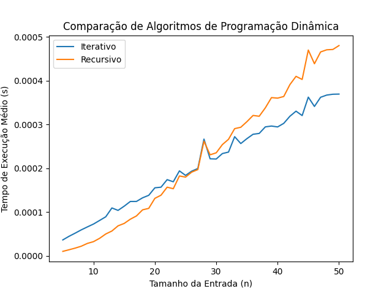

# Análise de algoritmos

Imagine que você está preparando uma mochila para uma trilha e precisa levar a **melhor combinação de itens possível**. Cada item tem um peso e um valor associado.

**_O objetivo é selecionar os itens de forma a maximizar o valor total, respeitando a capacidade máxima da mochila._**

## Código - solução

O código das soluções está em Python no arquivo `alg_dinamico.py`.

**Bibliotecas**:
- random: função para gerar valores aleatórios.
- matplotlib: Mostrar os resultados em gráficos.
- time: Calcular a média do tempo de execução dos algoritmos.

Utiliza a solução recursiva e iterativa.

**Recursiva** - Utiliza o mecanismo de memorização que cria a matriz de lucros e armazena os valores ótimos.

**Iterativa** - Utiliza o mecanismo de criar uma matriz de lucros e armazenar os valores ótimos.

## Resultados

O gráfico abaixo mostra o resultado:

Em conclusão, o algoritmo recursivo com memorização tem um tempo de execução maior que o algoritmo iterativo.